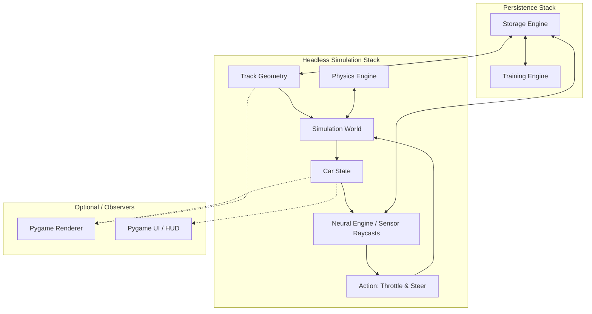

# EvoLap System Architecture (ARCHITECTURE.md)

This document defines the architectural boundaries, engine isolation rules, and directory standards for EvoLap.

---

## 1. Core Architectural Invariant

$$\textbf{Simulation is the single source of truth. Rendering is purely an observer.}$$



### Decoupling Rules:
1. **Zero Pygame in Simulation**: `core/`, `physics/`, `simulation/`, `neural_engine/`, and `training/` must **never import `pygame` or `rendering`**.
2. **Deterministic Ticks**: The simulation advances via discrete, fixed time steps ($\Delta t = 1/60\text{s}$), allowing headless simulation at arbitrarily high speeds.
3. **Observation-Only Rendering**: The renderer and UI read `CarState` and `Track` data to draw frames. They do not calculate or modify physical states.

---

## 2. Engine Breakdown

### 2.1 `core/` (Math & Geometric Primitives)
- Vector arithmetic (`Vector2D`), line segments, bounding boxes.
- Line intersection algorithms, projection, and distance calculation.
- Shared constants (unit scales, default simulation $\Delta t$).

### 2.2 `physics/` (Vehicle Dynamics & Collisions)
- Pure mathematical kinematics and kinetics:
  - Longitudinal dynamics: Throttle curve, braking force, engine drag, rolling resistance.
  - Lateral dynamics: Steering angle rate limit, centrifugal forces, slip friction.
  - Collision math: Line-segment intersection with track boundaries.

### 2.3 `simulation/` (World Coordinator & Entities)
- `World`: Orchestrates time steps, active entities, lap counting, and boundary checks.
- `Track`: Holds geometric representation of track boundaries, asphalt polygon, and checkpoints.
- `Car`: Physical entity state container (position, velocity, angle, steering, status: `Running`/`Out`).

### 2.4 `neural_engine/` (Autonomous Driving Sub-Product)
- **Scalable Sub-Product**: Maintained as an independent module with its own internal subversioning (`NeuralEngine v1.0.0`, `v1.1.0`, etc.).
- **Components (in version 1)**:
  - `sensors.py`: Raycast emitter calculating distance along 5 angles ($-60^\circ, -30^\circ, 0^\circ, +30^\circ, +60^\circ$).
  - `model.py`: Multi-Layer Perceptron (7 inputs, 16 hidden, 16 hidden, 2 outputs, `tanh` activation) using pure NumPy.
  - `policy.py`: Action mapping and output normalization.

### 2.5 `training/` (Evolutionary System)
- Genetic algorithm routines: population initialization, fitness scoring, roulette/tournament selection, Gaussian weight mutation.
- Checkpoint manager for generational state snapshots.

### 2.6 `rendering/` (Pygame Visualizer)
- `Camera`: Full-Track viewport and Follow-Cam with smooth damping (lerp).
- `TrackRenderer`: Visualizes tarmac, kerbs, barriers, and start/finish line.
- `CarRenderer`: Visualizes F1 chassis with articulable front wheels indicating steer angle.

### 2.7 `ui/` (Pygame HUD & Overlays)
- Left Leaderboard (positions, flags, driver codes, laps, running status).
- Right Telemetry (generation counter, car count, active cars, camera toggle button).
- Laboratory / Menu interface components.

### 2.8 `storage/` (Persistence Engine)
Preserves three dedicated subdirectories:
```
storage/
├── models/                  # Serialized trained Neural Engine weights (JSON / NumPy .npz)
├── tracks/                  # Track geometry definitions and checkpoint configs
└── training/checkpoints/    # Generational checkpoints and training run logs
```

---

## 3. Directory Layout

```
EvoLap/ (project root)
├── core/
│   ├── __init__.py
│   ├── math2d.py
│   └── constants.py
├── physics/
│   ├── __init__.py
│   ├── dynamics.py
│   └── collisions.py
├── simulation/
│   ├── __init__.py
│   ├── world.py
│   ├── track.py
│   └── car.py
├── neural_engine/
│   ├── __init__.py          # Exports NeuralEngine and __version__
│   ├── sensors.py
│   └── model.py
├── training/
│   ├── __init__.py
│   ├── genetic.py
│   └── evaluator.py
├── rendering/
│   ├── __init__.py
│   ├── renderer.py
│   ├── camera.py
│   ├── track_view.py
│   └── car_view.py
├── ui/
│   ├── __init__.py
│   ├── hud.py
│   └── widgets.py
├── storage/
│   ├── __init__.py
│   ├── models/
│   ├── tracks/
│   └── training/checkpoints/
└── main.py
```
